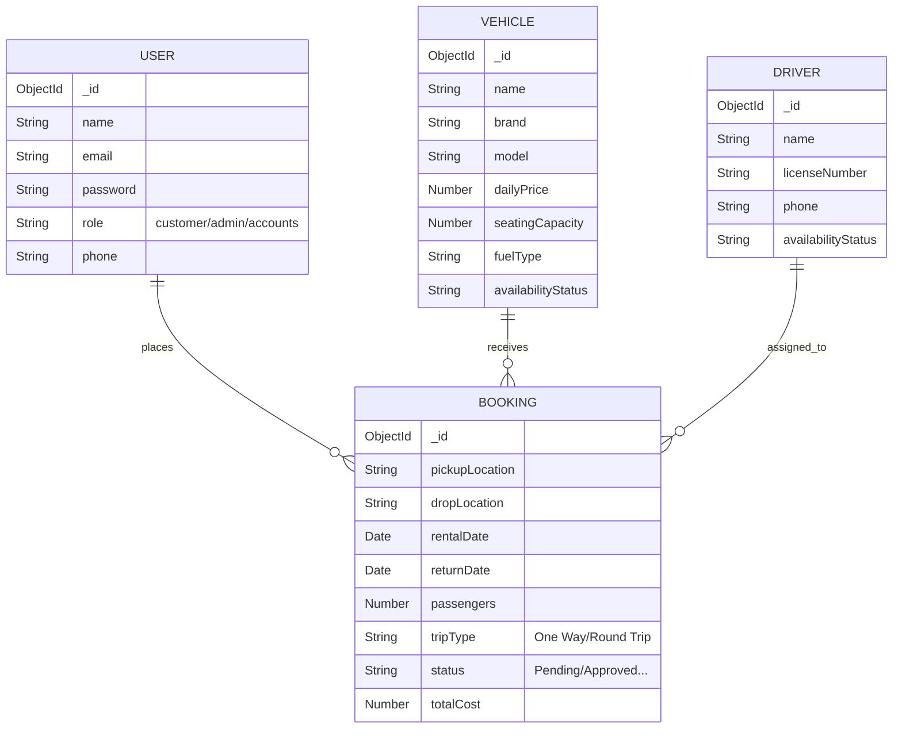

# Review 2 Deliverables
**Date:** 19-20 June 2026
**Team:** Student 1 (Frontend), Student 2 (Backend), Student 3 (Testing & Deployment)

---

## 1. Proposed System Description
The proposed **Car Rental Booking System** eliminates manual interventions by creating a single source of truth for both customers and business operators. 

### Customer Experience (Frontend)
Customers log into a responsive web application built with React. They navigate to a "Fleet Selection" page, which presents the available vehicles with dynamically calculated daily prices. Upon selecting a vehicle, customers enter trip details (pickup/drop locations, trip type, dates, and passengers) into the Booking Form. A smart rule-based engine will prevent date overlaps immediately using the backend API.

### Operations Dashboard (Frontend & Backend)
Business staff securely access role-based dashboards:
- **Administrators**: Create and update the vehicle fleet, assign drivers, and view high-level analytics charts.
- **Driver Coordinators**: View pending bookings, assign available chauffeurs, and track the status to "Trip Completed."
- **Accounts**: Manage transaction states and export CSV/PDF invoices for financial auditing.

### API & Data Processing (Backend)
The backend is a Node.js Express server utilizing MongoDB. Endpoints like `POST /api/bookings` handle complex validations (e.g., ensuring return dates strictly succeed rental dates). State progression (`Pending` -> `Approved` -> `Driver Assigned`) is tightly controlled through authenticated `PUT` requests, ensuring a rigid workflow that eliminates lost requests or missed communications.

---

## 2. Database Schema & ER Diagram

The system employs a NoSQL database (MongoDB), but adheres to strict relational definitions via Mongoose schemas. Below is the Entity-Relationship mapping for the core collections:

---

## 3. Integration Test Plan

**Test Strategy:** Integration testing focuses on verifying the data flow between the React frontend forms, the Node.js API endpoints, and the MongoDB collections. 

| Test ID | Test Description | Pre-conditions | Execution Steps | Expected Result |
|---|---|---|---|---|
| **INT-01** | Booking Date Conflict | Vehicle `V1` is booked from June 10-15. | Attempt to book `V1` from June 14-18 using the frontend form. | Form displays error: "Booking Overlaps detected. Pick other dates." DB remains unchanged. |
| **INT-02** | End-to-End Successful Booking | Customer is logged in. | Submit form with valid dates, locations, and passengers. | Success screen shown. MongoDB creates new Booking document linked to User and Vehicle IDs. |
| **INT-03** | Status Workflow Progression | Booking `B1` exists as "Pending". | Admin logs into dashboard and updates `B1` status to "Approved". | API returns 200 OK. Dashboard refreshes to show Green "Approved" badge. |
| **INT-04** | Role-Based Access Control | Customer is logged in. | Customer navigates to `/api/drivers` endpoint directly in browser. | API returns 403 Forbidden. React router redirects to Customer Dashboard. |
| **INT-05** | Invoice Generation | Booking `B1` is "Trip Completed". | Customer clicks "Download Invoice" on detail page. | Backend streams a correctly formatted PDF file matching the `totalCost` in MongoDB. |

---

## 4. Review 2 PPT Presentation Outline

### Slide 1: Review 2 Title Slide
- Title: Car Rental Booking System - Architecture & Core Logic
- Include names and roles.

### Slide 2: Literature Survey Summary
- Mention 3 referenced existing systems (e.g., Zoomcar, local rental systems).
- Highlight current limitations: lack of dedicated driver assignment, poor manual follow-up.

### Slide 3: Proposed System & Architecture
- Show the visual Architecture Diagram (React <-> Express <-> MongoDB).
- Explain the role of the REST API.

### Slide 4: Database Design (ER Diagram)
- Show the Mermaid ER Diagram.
- Explain the relationships between User, Booking, Vehicle, and Driver collections.

### Slide 5: Core Booking Logic
- Explain the validation rules (Date checking, passenger counts, trip types).
- Show the workflow sequence (`Pending` -> `Approved` -> `Completed`).

### Slide 6: Initial Code Demo
- Live demo of the Booking Form correctly talking to the backend (creating a record).
- Show Postman test results.

### Slide 7: Q&A
- Ask for feedback on database design and API contracts.
